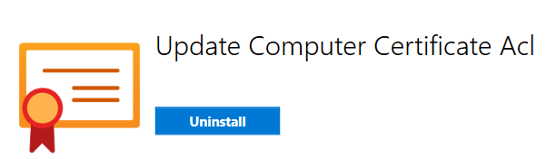
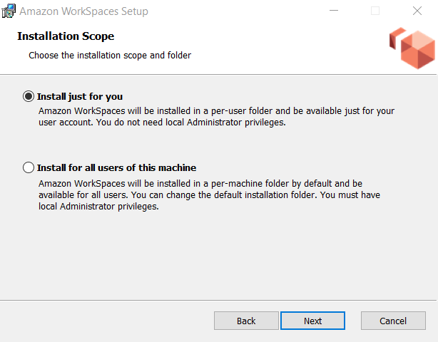
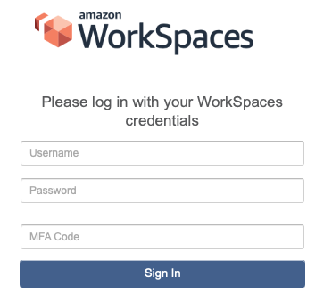

.. _accessing-the-dsh:

Accessing The DSH
=======================================

Unlike in the :term:`RCC` platform, the :term:`DSH` requires you to access the system via a `Bastion Host <https://en.wikipedia.org/wiki/Bastion_host>`_ created specifically for your project.
This comes in the form of a virtual desktop hosted in AWS WorkSpaces, for which you'll need software to access.

.. note:: 
    You will only be able to access your workspace via a University of Sheffield managed desktop while onsite (connected to the campus network).
    
    Attempting to connect while offsite, even while connected to the VPN will result in an authentication failure.

.. _install-aws-workspaces-client:

Install the AWS WorkSpaces Client
---------------------------------------

Before proceeding, you'll need to ensure you have received conformation that your DSH account and workspace has been fully provisioned for use with your university account.

1. Open the App Center, search for and ensure the "Update Computer Certificate Acl" application is available and installed:

|

2. Download the latest Windows client from the `WorkSpaces <https://clients.amazonworkspaces.com/>`_ website
3. Run the WorkSpaces client installer
    - When prompted choose "Install just for you":

|

4. When the installer completes open WorkSpaces and enter your workspace registration code

You should now be ready to enter your login credentials.
