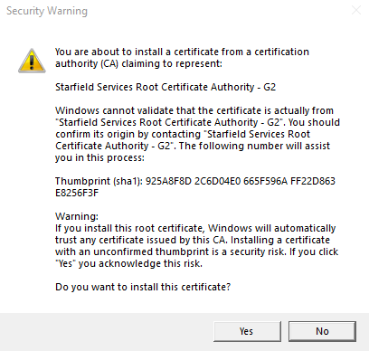

.. _accessing-the-dsh:

Accessing The DSH
=======================================

Unlike in the :term:`RCC` platform, the :term:`DSH` requires you to access the system via a `Bastion Host <https://en.wikipedia.org/wiki/Bastion_host>`_ created specifically for your project.
This comes in the form of a virtual desktop hosted in AWS WorkSpaces, for which you'll need software to access.

.. _install-aws-workspaces-client:

Install The AWS WorkSpaces Client
---------------------------------------

Before proceeding, you'll need to ensure you have received conformation that your DSH account and workspace has been fully provisioned for use with your university account.

1. Open the Software Center, search for and ensure the "Update Computer Certificate Acl" application is available and installed:

|

2. Download the latest Windows client from the `WorkSpaces <https://clients.amazonworkspaces.com/>`_ website
3. Run the WorkSpaces client installer
    - When prompted choose "Install just for you":

|

5. If prompted with a prompt to install a new certificate for the Starfield Services Root Certificate Authority (CA) select ``Yes``

|

4. Follow through the rest of the prompts until the installer has finished

Connect To Your WorkSpace
---------------------------------------

.. note:: 
    You will only be able to access your workspace via a University of Sheffield managed desktop while onsite (connected to the campus network).
    
    Attempting to connect while offsite, even while connected to the VPN will result in an authentication failure.

During the account setup process you should have received an email containing the registration code for your WorkSpace.
Once you open the WorkSpaces app on your machine enter the registration code as prompted:

You should then be prompted with to enter your DSH credentials:

Here you will enter your ``dsh_`` username and password. In the MFA field you will need to obtain a one time code from your Duo app:

Once you have entered the MFA code make sure to press the ``Refresh Passcode`` button as these are one time use only.

When you sign into your WorkSpace for the first time you may be prompted with a firewall security alert:

.. image:: images/ws-connect-4.png
    :align: center
    :scale: 75%

You can safely cancel off this page.

The WorkSpace should now start up and connect after a few minutes.
If you encounter any issues during this process please take a look at the troubleshooting steps below.

Troubleshooting
^^^^^^^^^^^^^^^^^^^^^^^^^^^^^^^^^^^^^^^

The most common error while entering your registration code is the "Unable to authenticate" screen:

This may appear when the device you are connecting with is not authorized to register with your WorkSpace.
Potential causes:

* Attempting to connect with an un-managed device (When connecting you will need to do so from a university provided managed YoYo desktop)
* Computer certificate inaccessible (Ensure step 3. of the `install-aws-workspaces-client`_ section has been followed)

If neither of these apply and the issue persists, or if there are any other issues please log a helpdesk ticket.

Understanding Your Access
---------------------------------------

Now that you have a way into the DSH, you should familiarize yourself with the different things you can and cannot access via your WorkSpace.

.. image:: images/project-architecture.jpg
    :align: center

|

The diagram above shows a simplified layout of your access in the DSH.
From your workspace you will be able to access:

* Ronin
* Machines/Instances in your project/s
* Internal Gitlab
* Internal update mirrors
* Authentication services

Machines/Instances in your projects/s will have additional access to things like:

* Object Storage
* Internal CRAN / Pypi mirrors
* Unrestricted access to each other (machines in your projects have no firewalls between each other)

Ronin
^^^^^^^^^^^^^^^^^^^^^^^^^^^^^^^^^^^^^^^

Your workspace will come pre-configured with Firefox as the default browser.
It is configured to automatically take you to the Ronin web UI as the default home page.

Machines/Instances
^^^^^^^^^^^^^^^^^^^^^^^^^^^^^^^^^^^^^^^

Access to your instances will be done through the Ronin Link desktop application.
Allowing you to connect to both Windows and Ubuntu machines with either SSH or remote desktop.

Object storage
^^^^^^^^^^^^^^^^^^^^^^^^^^^^^^^^^^^^^^^

Access to object storage you create in your project is limited to the instances you assign permissions to.
You won't be able to access a bucket from your instance even with valid credentials until it is given additional permissions to do so.

External Services
^^^^^^^^^^^^^^^^^^^^^^^^^^^^^^^^^^^^^^^

Certain projects may be granted special access outside of the DSH's firewall, this is primarily restricted to things like licensing servers.
