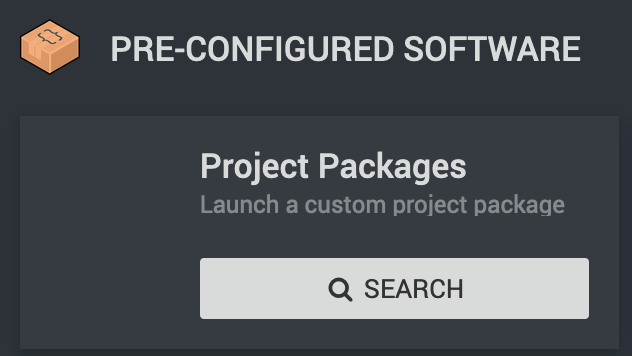
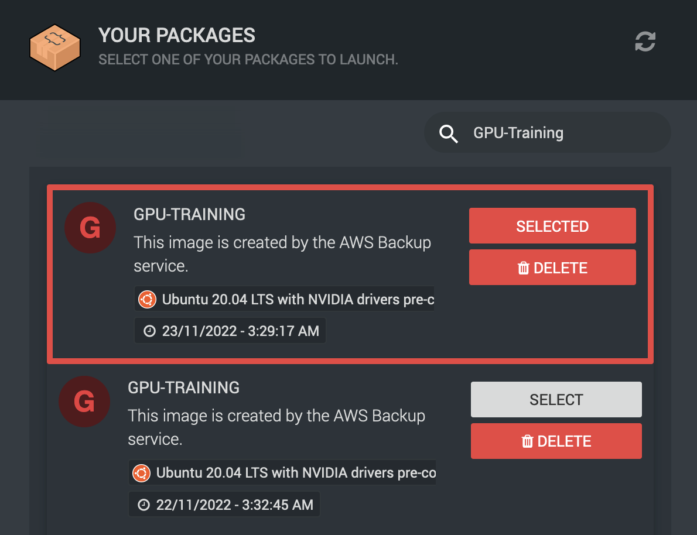

.. _backup-restore:

Backup and Restore
=======================================

As :term:`RCC` is built upon AWS we're making use of the automated backup systems they provide.
As such you are able to make use of these features in the event of data loss/corruption to restore from an alternate point in time.

.. _restoring_machines:

Restoring Machines
---------------------------------------

Due to the technical implementation automated backups show up under the packages section in Ronin, but it is not where they are restored from.

As our backups are essentially packages, a restore is performed by `creating a new machine <https://blog.ronin.cloud/create-a-machine/>`_ and searching the "Project Packages" section under Step 1 of the machine creation screen.

Here you may find that there is a mix of your own self created :term:`project packages<Package>` and the scheduled backups. If you have a lot of machines it can become a little difficult to see the wood for the trees.

.. rst-class:: float-right

It's usually best to use the search function at the top right to find the name of the machine you are looking to restore. This can even be a machine you may have deleted within the retention period.

Once you have found your target machine in the list, select one that has a date of creation you're happy with (you may wish to go further back in time), close the packages window and continue as if you were going to create a new machine.

What you have essentially done here is clone a macihne from a set point in time. You may even still have the source machine running while this is happening.

After all is said and done you should now have a freshly restored machine.

.. rst-class:: float-right

.. warning:: 
    As your restored machine is being spun up background tasks will kick in to make sure that it is up-to date. This ensures machines that have been restored from months old backups have the latest updates applied immediately.
    
    You may find that the machine reboots itself one or more times without warning shortly after creation.

.. admonition:: Windows Renaming

    If your restored machine is running the Windows family of OSes you'll find that the computer name gets '-restored' suffixed to avoid naming conflcts.

.. _restoring_s3_objects:

Restoring S3 Objects
---------------------------------------

.. warning:: 
    Data in your S3 buckets is backed up using object versioning. This feature is **NOT** automatically enabled for you at creation of a new bucket. This can be done in Ronin shortly after you create new object storage.

Any changes to a file after its inital creation will form a new version, allowing you to browse through the old ones should you need to revert to an earlier point in time.

.. hint:: 
    The best place to learn about versioning is via the AWS documentation on `versioning <https://docs.aws.amazon.com/AmazonS3/latest/userguide/versioning-workflows.html>`__ itself.
    
    Or should you be using Cyberduck, their documentation on `versioning <https://docs.cyberduck.io/protocols/s3/#versions>`__ will help too.

Versioning enables something of a self service restore, more of a quasi backup and not what we'd consider fool proof.
For that reason we also keep backups of your data in a vault not accessible to end-users.

In the event you are not able to restore your files to an earlier point in time using versioning, please get in touch via the IT Services Helpdesk.

.. _backup-retention:

Backup Retention
---------------------------------------

You may have seen reference to retention in differing parts of this documentation.
Retention in a backup context is the amount of time we keep backups for and their granularity.

In a perfect world this would be indefinite, however the more backups we keep the more data is kept and therefore cost increases.

Machine backups
^^^^^^^^^^^^^^^

We currently keep backups with the following retention:
    - 14 Daily backps
    - 8 Weekly backups

This means you can go 2 months back in time with weekly increments, or 2 weeks with daily.

Bucket backups
^^^^^^^^^^^^^^

Full bucket backups follow the same retention policies as machine backups, however versioning only presents you with the last 14 days of changes.

If you have a file you'd wish to restore that's not showing up in versioning please get in touch via the IT Services Helpdesk.

.. _backup-schedule:

Backup Schedule
---------------------------------------

Backup jobs are scheduled to start at 00:00 GMT, however they have an 8 hour starting window. Meaning that the time of the backup could be anywhere between 00:00 GMT and 08:00 GMT.

When restoring a machine you will always know the time of the backup as it is labelled on the package down to the minute.
