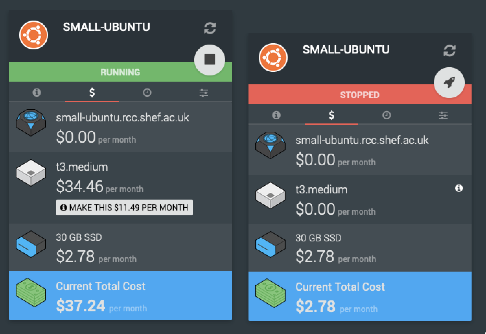

.. _budgets:

Budgets
=======

Although RCC is currently free-at-point-of-use, all projects are assigned budgets. So why is that important to you?

At project creation we'll estimate a sensible budget based on your project length and predicted compute & storage requirements, that's not to say you'll be restricted once you hit the budget limit.

By default all projects that hit their budget go into something called "auto pause", this will stop all running :term:`instances<instance>` in the project. This is mostly in place to prevent accidental over usage.

.. note:: 
    When auto pause triggers, there is nothing stopping you from going in and starting your machines back up!

    Both project users and system administrators will be notified of your budget approaching and/or hitting its limit / end date.
    
    We'll usually contact you when this happens to make sure things are on track and if needed, extend the budget / project timeline.

Project dashboard
-----------------

At a glance your project dashboard has a periodically updated budget breakdown that will try to forecast based on your usage at the time. It's important to note that this is not always up-to date.

If you've poked around Ronin already you'll note that when creating resources there's usually a $/h or $/m metric paired along with it, these are all things that will eat into your budget and eventually end up on the dashboard.

.. hint:: 
    There is a small 🕣 icon at the right hand side of your dashboard budget, click this and you'll see the exact time the information was updated.

Machines
--------

When creating a machine in Ronin it will give you a breakdown of costs as you size the instance.
This usually boils down to a cost per hour to run the instance and cost per month for the underlying attached storage (which is handily calculated in the hourly charge).

.. warning:: 
    Although storage costs are shown in the hourly usage this is actually a flat monthly rate based on the storage type and size.

    Which means when the instance is turned off you wont be charged for the compute but will still be charged for the storage!

With a machine created, the costs for the instance will show up in the $ tab of its panel:

|

As noted above the instance in a running state will cost more per month than in the stopped state, but there will still be some charge with it in the stopped state.
