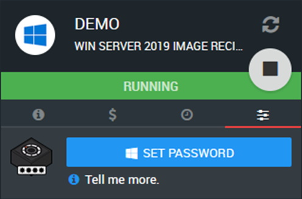

.. _known-issues:

Known Issues
=======================================

Here you will find a list of known issues, causes and potential workarounds/fixes. If you're facing an issue not mentioned here or in the :ref:`limitations-considerations` page, please get in touch via the IT Services Helpdesk.

.. _windows-machines:

Windows Machines
---------------------------------------

Unlike the available Linux distributions, Windows Sever is more resource intensive and usually takes longer to become available.
This has led to confusion in some cases.

Unable to connect to new machine
^^^^^^^^^^^^^^^^^^^^^^^^^^^^^^^^

**Problem:** Upon creation of a machine, Ronin shows the :term:`instance` as “Available” however the system may be inaccessible via Ronin Link or SSH.

**Solution:** Windows images are not handled properly in the current Ronin build. They typically take 15 minutes to start-up at initial creation, simply wait a little longer before trying to connect. Avoid restarting the machine during this time.

Unable to connect to machine - Reoccurring
^^^^^^^^^^^^^^^^^^^^^^^^^^^^^^^^^^^^^^^^^^

**Problem:** I'm having issues connecting to my instance, even though I might have been able to connect earlier.

**Solution:** In some edge cases windows passwords have been reset by the system, making them inaccessible even if you've managed to connect before.
To fix this open up the Ronin UI and perform a password reset on the machine.

Slow/Unresponsive desktop session
^^^^^^^^^^^^^^^^^^^^^^^^^^^^^^^^^

**Problem:** I have a machine and have connected into the desktop via Ronin Link, however it is painfully slow!

    Initial start-up time average: 25 minutes

    Initial start-up time average: 10 minutes

**Solution:** The most likely scenario here is that the instance type chosen is simply unfit for purpose.
Unlike the available Linux distros, Windows usually likes to have more power.
Try selecting a bigger instance type when creating the machine. This usually links back to the first problem as it is exacerbated by the lower performance.

.. note:: 
    This is the :term:`RCC` platform after all, we encourage you to use the big computers!

.. _ubuntu-machines:

Ubuntu Machines
---------------------------------------

**Problem:** Connecting to a remote desktop session gets stuck in a loop after trying to install.

**Cause:** Ronin Link creates a desktop environment by SSHing into the target machine and running the installation step by step, these commands all originate from the machine running Ronin Link. 

If at any point in the install the connection is broken (i.e. Network connectivity is lost) then there is potential for the installer to break and soft lock future attempts.    

.. rst-class:: clear-both

**Solution:** If the machine is brand new it might be easier to terminate the instance and try again with a new machine.
If you need to access the machine it should still be available over SSH, although if access over the desktop environment is a must please get in touch via the IT Services Helpdesk.

**Problem:** Connecting to a remote desktop session opens a new screen but doesn't show anything.

**Solution:** Close the session window and try to connect again. Most of the time this is enough to get the session to connect and most commonly happens with brand new instances.

.. note::
    An easy way to know if the session is working is that there will be a spinning circle to indicate the session is connecting.
