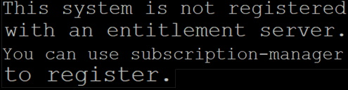

.. _limitations-considerations:

Limitations / Considerations
=======================================

Through the pilot phase there will be aspects of the system that may be partially available or come with limitations/considerations.

.. _rhel-machines:

Red Hat Machines
---------------------------------------

**Problem:** You receive the message “This system is not registered with an entitlement server. You can use subscription-manager to register.” when attempting to install or update :term:`packages<package>` on the system.

**Cause:** For the pilot phase we currently do not manage RHEL subscriptions.

.. rst-class:: clear-both

**Solution:** The only current course of action is to register the machine with your own Red Hat subscriptions. Take care when doing so if you intend to re-package this machine or share access out to other project users.

.. _gpu-backed-machines:

GPU Backed Machines
---------------------------------------

Ronin provides access to a handful of GPU backed :term:`AWS instances<instance>`,given there are so many options we've decided to keep to providing one pre-configured package.

The **"Ubuntu 20.04 LTS - NVIDIA Drivers"** package comes with drivers and software pre-configured to work with Ronin's remote desktop solution Nice DCV, allowing you to skip the somewhat tedious configuration steps.

.. note::
    If you choose to use the standard Ubuntu package with a GPU backed machine and install the desktop environment via Ronin Link
    you may find that the remote session is not making use of the GPU.
    
    Take a look at the `Nice DCV <https://docs.aws.amazon.com/dcv/latest/adminguide/setting-up-installing-linux-prereq.html#linux-prereq-gpu>`_ docs for further info.

Changing Instance Type After Creation
^^^^^^^^^^^^^^^^^^^^^^^^^^^^^^^^^^^^^

In the event you make use of the **"Ubuntu 20.04 LTS - NVIDIA Drivers"** package at initial startup the machine will configure itself with the available GPU/s.

It may be the case that your workload changes overtime making it necessary to increase or decrease the instance size, adding or removing GPUs.

So that the DCV config can pick up on these changes you should run the commands below following an instance type change:

.. code-block:: bash

    nvidia-xconfig --preserve-busid --enable-all-gpus
    sed -ie '/Section "Device"/a \ \ \ \ Option     "HardDPMS" "false"' /etc/X11/xorg.conf

    systemctl isolate multi-user.target
    systemctl isolate graphical.target

    reboot
