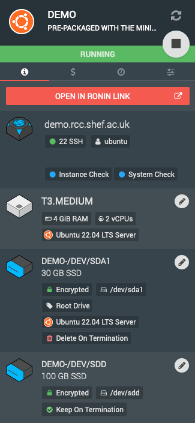

.. _notifications:

Notifications
=======================================

As a creator / owner of resources inside Ronin you may receive Email based notification depending on their state.
These intend to alert you of possible under utilization of resources to help avoid unnecessary project spend.

.. note::
    All notifications will come from the address **noreply@ronin.cloud**, always be cautious when following links from external addresses!

.. _instance_utilization:

Instance Utilization
---------------------------------------

If you have received an email titled "Ronin Under Utilization Alert!" this means that Ronin has noticed an :term:`instance` in your project has gone for more than more than 24 hours with under 10% CPU utilization.
This is designed to ensure you've not accidentally left a machine running idle. Unlike on-premise VMs that run 24/7 we recommend you shut down your instances when not in use, much like you would your own PC. 

Only instances that are running are subject to the hourly usage rates however you will still be charged for the provision of storage as is explained below.

We do also understand this alert could be a false positive where your workloads are not CPU demanding but still require the machine be on for extended periods.
If this is the case please get in touch and we can make the instance exempt from these alerts.

.. _unused_drive_storage:

Unused Drive Storage
---------------------------------------

If you have received an email titled "Unused Drive Storage Detected" this means that Ronin has noticed detached drives have been in your project for extended periods.

This could be from a terminated instance that had the "Keep On Termination" flag set:

|

Or volumes that were detached and forgotten etc...

As provisioned volumes are charged for based on how much storage is requested it's best practice remove unused storage once it's no longer required.
For long term and/or bulk data storage we recommend you use :ref:`object-storage` 
