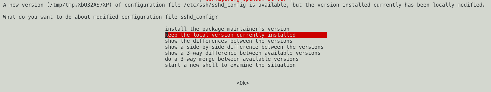

.. _upgrading-ubuntu:

Upgrading Ubuntu to 22.04
=======================================

When the :term:`RCC` pilot began it was restricted to the deployment of Ubuntu 20.04 due to technical limitations.
Although these are no longer present and the default Ubuntu image is now 22.04, some projects will still have active 20.04 instances.

Ubuntu 20.04 will go end of support on `April 2025 <https://wiki.ubuntu.com/Releases>`_, we're therefore suggesting that people running instances upgrade at their earliest convenience.

Taking a Backup
---------------------------------------

Before performing an upgrade we strongly recommend that you take a backup of your machine:

|

By navigating back to the backup menu for your machine, check the "Project Backups" tab and wait for your backup to complete before continuing:

|

Upgrading the Instance
---------------------------------------

1. With a backup taken, start your instance and connect to the CLI. The login banner should show that there is a new release available

|

2. As suggested by the banner, run ``sudo do-release-upgrade`` to start the process

|

Continue by entering ``y`` and hitting enter.

3. As with step 2, continue by entering ``y`` and hitting enter

|

4. The update process will now start, after a short amount of time you may be asked to restart services

|

With your arrow keys select ``<Yes>`` and hit enter.

5. You may be asked if you want to keep the existing SSH config file

|

If you're unsure what this might affect, use the arrow keys to select ``Keep the local version currently installed`` and hit enter.

6. The upgrade process will now find obsolete software to be removed, you can see the details from these by hitting ``d``

|

When you're happy type ``y`` and hit enter to continue.

7. You should next see an installation success screen. It is suggested you reboot the machine at this point as prompted

|

8. After a short wait you should be able to reconnect to your instance and see in the login banner that you are now using on Ubuntu 22.04

|

Ronin Link may still show your machine as being on 20.04, to fix this simply remove and re-add the instance.

|

With that you now have an up-to date Ubuntu instance!
