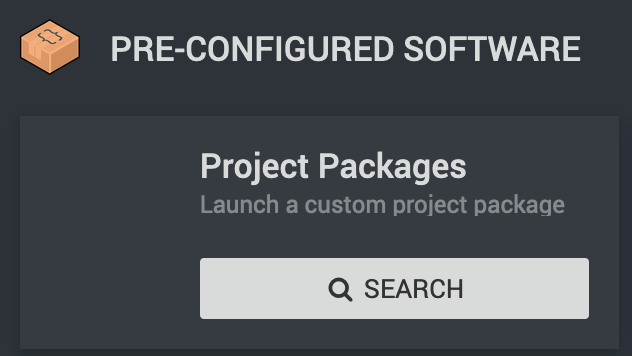
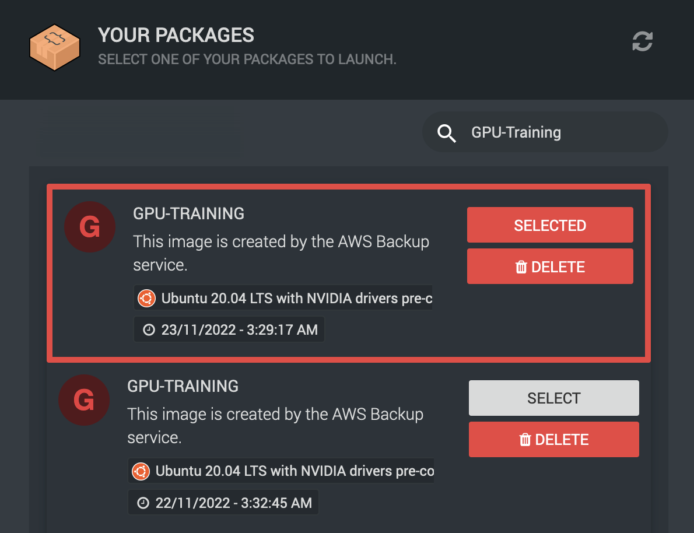

.. _backup-restore:

Backup and Restore
=======================================

As :term:`RCC` is built upon AWS we're making use of the automated backup systems they provide.
As such you are able to make use of these features in the event of data loss/corruption to restore from an alternate point in time.

Backup and restoration is split out into 'Machine' and 'Object Storage' as the data stored is handled differently for each. Machines are backed up and restored in full at a single point in time whereas object storage is much more granular, allowing you to restore to specific versions and at an individual object level.

.. _backup-schedule:

Backup Schedule
---------------------------------------

Backup jobs are scheduled to start at 00:00 GMT, however they have an 8 hour starting window, meaning that the time of the backup could be anywhere between 00:00 GMT and 08:00 GMT.

When restoring a machine you will always know the time of the backup as it is labelled on the package down to the minute.

.. _backup-retention:

Backup Retention
---------------------------------------

Retention in a backup context is the amount of time we keep backups for and how frequently we create backups (their granularity).

In a perfect world this would be indefinite, however the more backups we keep the more data is kept and therefore cost increases.

Machine backups
^^^^^^^^^^^^^^^

We currently keep machine backups with the following retention:
    - 14 daily backups
    - 8 Weekly backups

This means you can go 2 months back in time with weekly increments, or 2 weeks with daily increments.

Object Storage / Bucket backups
^^^^^^^^^^^^^^^^^^^^^^^^^^^^^^^

:term:`Bucket` backups follow the same retention policies as machine backups.

Data in your object storage is backed up using 'versioning'. This feature **is** automatically enabled for you at creation of a new bucket along with the creation of a lifecycle rule.
Should you wish to know more we recommend you read our docs on object storage :ref:`object-storage`.

.. note:: 
    Although versioning is required for our backup policy to work (which is why it is enabled for you by default) object versions are not correlated with object backups.
    Read on to :ref:`restoring_s3_objects` for more information on how this effects restoration of objects.

.. _restoring_machines:

Restoring Machines
---------------------------------------

Restoration of machines is a 2 step process. Step 1. is to log a helpdesk ticket requesting a Ronin machine restore, for this we will need to know:

- The machine name as presented in Ronin
- Potential restore date/s

After this information has been sent over you will receive a response once access to the requested backup/s have been added.

As automated backups show up as Ronin Packages a restore can be performed by `creating a new machine <https://blog.ronin.cloud/create-a-machine/>`_ and searching the "Project Packages" section under Step 1 of the machine creation screen.

|

Here you may find that there is a mix of your own self created :term:`project packages<Package>` and the backups you've requested access too. If you have a lot of machines it can become a little difficult to see the wood for the trees.

It's usually best to use the search function at the top right to find the name of the machine you are looking to restore.

|

Once you have found your target machine in the list, select one that has a date of creation you're happy with (you may wish to go further back in time), close the packages window and continue as if you were going to create a new machine.

What you have essentially done here is clone a machine from a set point in time. You may even still have the source machine running while this is happening.

After all is said and done you should now have a freshly restored machine.

.. warning:: 
    As your restored machine is being spun up background tasks will kick in to make sure that it is up-to date. This ensures machines that have been restored from months old backups have the latest updates applied immediately.
    
    You may find that the machine reboots itself one or more times without warning shortly after creation.

.. admonition:: Windows Renaming

    If your restored machine is running the Windows family of OSes you'll find that the computer name gets '-restored' suffixed to avoid naming conflicts as you may still have the source machine running in your project.
    Depending on how the machine and its software has been configured, it may not be advisable to have source and restored machines running at the same time.

.. _restoring_s3_objects:

Restoring From Object Storage
---------------------------------------

With versioning enabled any changes to a file after its initial creation will form a new version, allowing you to browse through the old ones should you need to revert to an earlier point in time.

.. hint:: 
    The best place to learn about versioning is via the AWS documentation on `versioning <https://docs.aws.amazon.com/AmazonS3/latest/userguide/versioning-workflows.html>`__ itself.
    
    Should you be using Cyberduck, their documentation on `versioning <https://docs.cyberduck.io/protocols/s3/#versions>`__ will help too.

Versioning enables something of a self-service restore, more of a quasi-backup and not what we'd consider fool-proof.
For that reason we also keep backups of your data in a vault not accessible to end-users.

In the event you are not able to restore your files to an earlier point in time using versioning, or are having issues with versioned files please get in touch via the IT Services Helpdesk.
