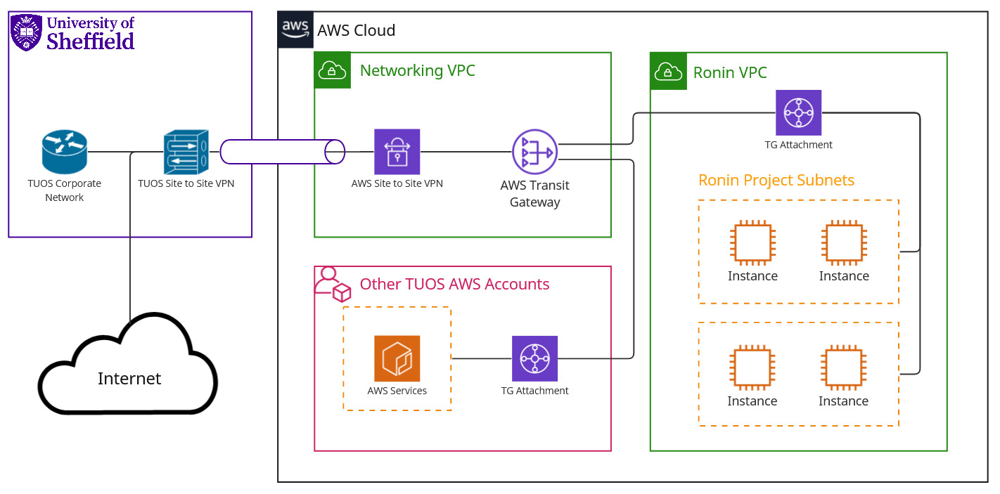

.. _networking:

Networking
=======================================

When you are given access to the :term:`RCC` platform it will come in the form of one or more "Projects" presented inside of Ronin.
Resources you create inside of these projects have differing levels of network access and accessability.

For the most part you will be working with what Ronin calls Machines and what we call :term:`Instances<Instance>`, these resources are placed into their own project specific subnet.
This is a way for Ronin to allow instances in a project to communicate with one another in a isolated manner.

Intended Usage
^^^^^^^^^^^^^^

It is important to understand that RCC is not designed to host services accessible to the outside world or campus for that matter.
You can however have host services designed to be accessed by other instances in your project or locally to yourself.

You can make use of `Ronin Link's <https://blog.ronin.cloud/ronin-link/>`_ "Connect to an Application" feature to proxy applications directly to the machine you connect in on,
this makes it as if the service were running locally.

Architecture
^^^^^^^^^^^^

Instances in your project/s have unrestricted access other instances in the same project, have access to the campus network and from there outbound to the web.
The graphic below goes into more detail:

.. note:: 

    Only outbound networking from a project subnet is unrestricted.
    Inbound access to the Ronin Instances is limited to SSH over port 22 TCP from the university VPN.

