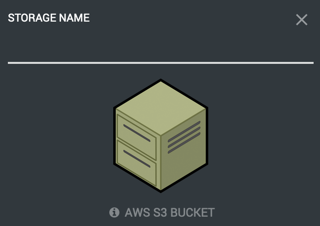
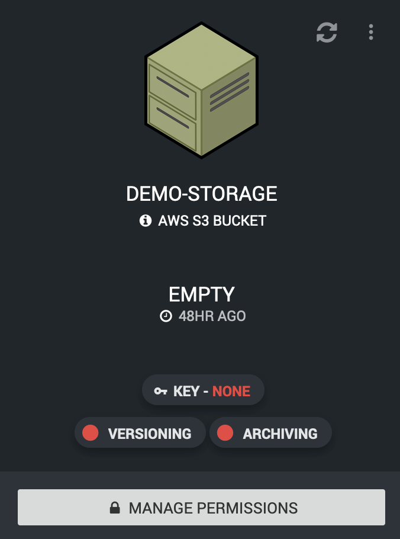
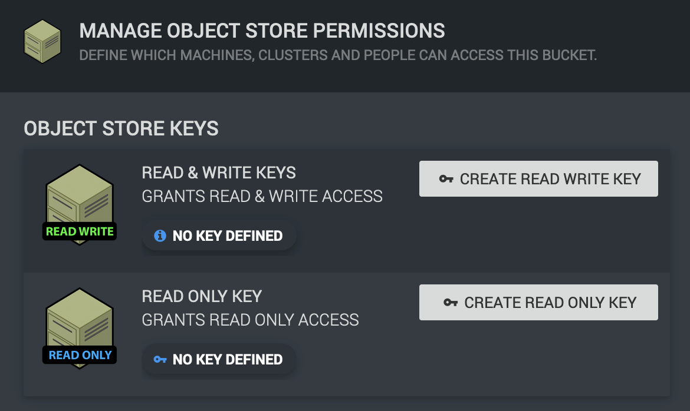
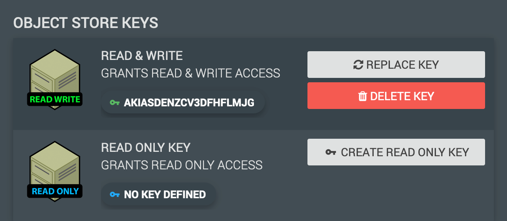
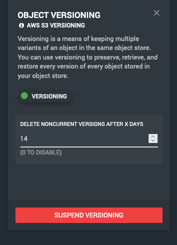
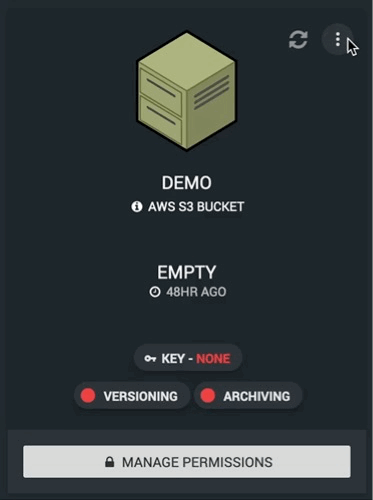
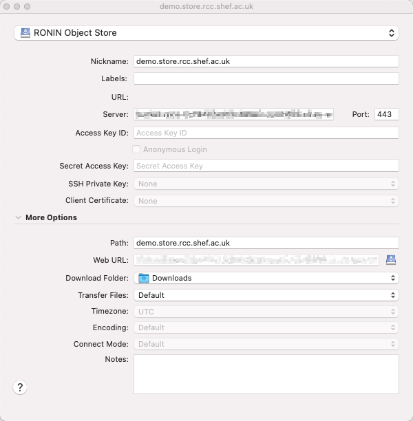
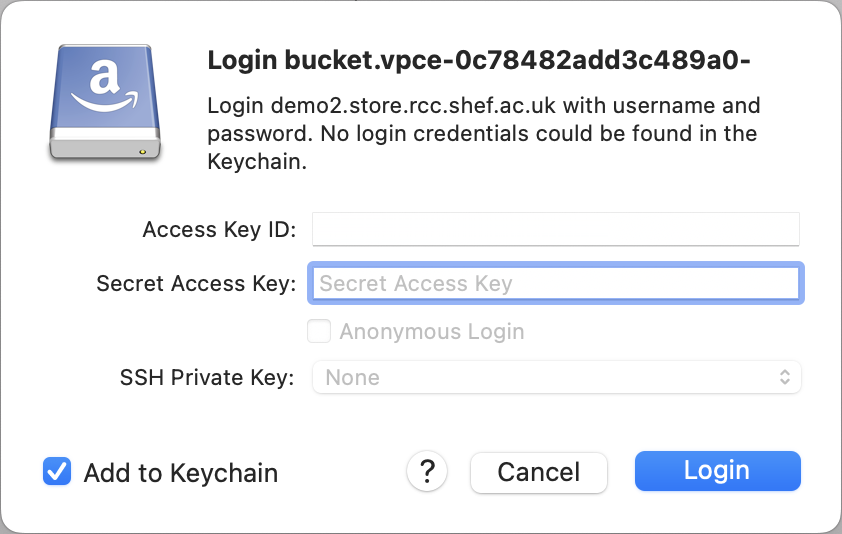

.. _object-storage:

Object Storage / S3
=======================================

Object Storage created in the :term:`RCC` platform has similar access restrictions to the instances.
To access Ronin object storage (other than from a Ronin instance) you will need to be connected to the university VPN.

For those unfamiliar, object storage in Ronin is very much like shared storage, behaving like folder for you to store and retrieve files from multiple different computers.
The most notable difference with object storage is that you don't generally have it mounted to your computer like an additional drive.

.. hint:: 

    The term "object/s" here is synonymous with the term "file/s"

    You may also see the term :term:`bucket` used frequently, this refers to the container in AWS's S3 Object Storage

.. _managing-object-storage:

Creating, Managing & Deleting Object Storage
^^^^^^^^^^^^^^^^^^^^^^^^^^^^^^^^^^^^^^^^^^^^

Creating a new bucket is as simple as navigating to a project and then "Object Storage" page via the right hand menu:

From here you can view and manage exiting buckets as well as create new ones with the "NEW OBJECT STORE" button:

Which will then present present a new field for you to name your object storage. 
This will need to be a unique name to Ronin as a whole, so bear in mind someone else may already have taken the name you want.

In the event that this is the case you will be presented with an error message prompting you to use an alternative name.

|

Once a suitable name has been used the new bucket should show up in the list ready for you to configure to further suit your needs.

You may note that after a bucket's creation there are a handful of red lights and text, these are here to denote that features are turned off or yet to be configured.
The steps below detail what each does and how / why you might want to configure them.

Creating & Managing Keys
------------------------

Access keys are the primary method of authenticating with your object storage, they can be thought of like a username and password where:

- AccessKeyId = Username
- SecretAccessKey = Password

Unlike a username / password pair however we do not get to manage them, instead they are generated for us.
To do this click on the "MANAGE PERMISSIONS" button along the bottom of the bucket you wish to manage.

|

You will then be presented with the option to generate either "Read & Write" or "Read Only" keys.
This refers to the level of permissions the given to the keys we generate.

"Read & Write" keys are allowed to:

- Access files & folders (read)
- Modify files & folders
- Create new files & folders
- Delete files and folders

"Read Only" keys are as you can probably surmise can only access files and folders within the bucket.

.. note::
    Both keys are also given access to read all file versions if the feature is enabled on the bucket

When you have selected which type of key you are looking to generate and click either of the "Create Key" buttons
you will see a `.csv` file with the name of your bucket downloaded to your computer.

This file contains the generated AccessKeyId and SecretAccessKey mentioned earlier.
You'll want to keep this safe and secure as they are the **only** copy of the key.

|

If the SecretAccessKey part is lost new keys will have to be generated, this is simple enough as the option will present itself in the
manage permissions window of your bucket. You will also note that you have the option to delete the keys and see the AccessKeyId to verify it is the correct key pair.

With keys in hand you are now ready to connect to the bucket, see :ref:`accessing-object-storage` for details.

.. _object-versioning:

Versioning
----------

Normally when a new bucket is created versioning is disabled by default. We however enforce versioning inside Ronin as it is a requirement for backups.

When you create a new bucket in Ronin you may even see this temporarily in the GUI, given a short period of time you'll note the versioning label on a new bucket turn from Red to Green:

|

You will also note that a default version lifecycle of 14 days is set. This can be altered should you wish to extend or reduce the version lifecycle.

What this means for you, adding, removing and editing objects in the bucket in day to day use will mostly be transparent.

The most important effect is that when you overwrite existing files in the bucket the old "version" of that file rather than being replaced is hidden as an invisible file, becoming an "old version" 
You are then able look back into the past so to speak to see these versions. These versions are kept based on the lifecycle set for the bucket, by default any versions older than
14 days are deleted.

.. hint:: 
    To understand more about how versioning works the AWS documentation on `versioning <https://docs.aws.amazon.com/AmazonS3/latest/userguide/versioning-workflows.html>`__ is the best place to look.

Though a useful tool, versioning comes with some caveats that might catch you out once in a while. Here are a few you might want to be aware of:

- Deleted files don't actually get deleted, but are given a `delete marker <https://docs.aws.amazon.com/AmazonS3/latest/userguide/DeleteMarker.html>`__ to hide them from view.
- When a file large or small is changed, regardless of frequency a new version is created in its place, these are kept until they hit the lifecycle age.
  Many versions of an object will appear as though you are being charged for having duplicates of the object. 
  You may wish to lower the lifecycle rules if this is the case, or perhaps move your storage onto another more suitable location such as :term:`EBS`.
- Before you can delete a bucket all files, versions and delete markers must be removed. With versioning this becomes a complex enough task to warrant it's own section.

.. note::
    Versioning is enforced in RCC. Though the GUI shows the option to "SUSPEND VERSIONING", when attempted versioning will simply re-enable itself.
    This is due to the requirement for versioning to be enabled for our backup system to work.

.. _object-archiving:

Archiving
---------

Enabling an archiving lifecycle to your bucket may be suitable if you are going to be uploading extremely large datasets and have worries about storage costs.
Object storage is already the best place to store large datasets when it comes to price, however archiving allows you to lower costs even more by
moving objects of a pre-defined age to S3 Glacier.

This is under the assumption that the data over the defined age will be accessed less frequently (sometimes considerably) than newer data.

As with anything there are caveats to this, the deeper the tier of archival you choose the lower storage costs you pay.
To balance out these lower storage costs you will need to pay more to retrieve archived data and in some cases even wait extended periods of time to access it.

As usual the best place to learn the fine details is in AWS's documentation. The `S3 Glacier storage classes <https://aws.amazon.com/s3/storage-classes/glacier/>`__
page has a breakdown of the differing archival tiers available for use in Ronin.

If you think that Glacier archival is right for you, but are still unclear on the potential implications please get in touch via the IT Services Helpdesk.

.. _deleting-object-storage:

Deleting a Bucket
-----------------

As explained in the :ref:`object-versioning` section, when files are deleted from a bucket in RCC they aren't really deleted. Simply given a delete marker which in turn will hide the object from view.

This along with object versions (which are typically also hidden from view) complicates the deletion of a bucket, given that they must also be removed before the bucket can be deleted.

There are a couple ways to go about this. The simplest and least involved method would be to change the version settings on the bucket to a lifecycle of 1 day,
then simply wait 24 hours and the lifecycle rule will remove the old versions for you.

Should you not have the time to wait for this however, you will need to manually delete versions and object markers from the bucket via the `AWS CLI <https://aws.amazon.com/cli/>`__.
With the AWS CLI installed and configured using your bucket access keys, you'll want to use the below commands to first delete all object versions and then delete markers from the bucket::

    aws s3api delete-objects --bucket <BUCKET NAME> \
    --delete "$(aws s3api list-object-versions --bucket <BUCKET NAME> --query='{Objects: Versions[].{Key:Key,VersionId:VersionId}}')"

    aws s3api delete-objects --bucket <BUCKET NAME> \
    --delete "$(aws s3api list-object-versions --bucket <BUCKET NAME> --query='{Objects: DeleteMarkers[].{Key:Key,VersionId:VersionId}}')"

.. warning::
    These commands will delete **ALL** versions and delete markers in the bucket!

Source: `<https://www.learnaws.org/2022/07/04/delete-versioning-bucket-s3/>`__

With that done you should now be able to delete the bucket from within the RCC GUI.

.. _accessing-object-storage:

Accessing Object Storage
^^^^^^^^^^^^^^^^^^^^^^^^

As mentioned previously access to your object storage from outside the machines in your project is restricted to the VPN.
This restriction has an impact on how you access the buckets as you need to specify an alternate S3 endpoint to the public AWS servers,
this endpoint being something only accessible via the VPN.

Windows / Mac - Cyberduck
-------------------------

Cyberduck is a free to use application available on Windows and Mac, suggested for use by Ronin with some handy direct integration to make connecting to your object storage easier.

.. hint:: 
    Cyberduck comes pre-installed on the Windows images provided in Ronin

If your wanting to use Cyberduck on your own machine simply install the relevant version on your machine from their site `<https://cyberduck.io/download/>`__

.. _install-cyberduck-profile:

Installing Cyberduck profiles
~~~~~~~~~~~~~~~~~~~~~~~~~~~~~

After a bucket is created head over to the "CONNECT INFO" panel of the relevant storage:

|

At the bottom will be a button to download the Cyberduck profile for the selected bucket.
With the ``.cyberduckprofile`` file in hand import the file by double clicking it, this will open Cyberduck and present a new connection window:

|

From this screen you can enter the AccessKeyId and SecretAccessKey into the relevant fields, **please note** doing so will save the credentials to your computer.

Alternatively you can close off the screen to show the new bookmark, if you've not entered the credentials you will be asked for them upon opening the bookmark:

|

Here you have the option **not** to save the credentials by un-ticking "Add to Keychain" on Mac or "Save password" on Windows.

Given the credentials are valid you should now be able to access your bucket!

Linux - AWS CLI
---------------

Though not Linux specific as the AWS CLI will work on any of the operating systems mentioned,
we suggest this here as there are fewer alternate solutions for Linux.

Firstly you'll want to follow the instructions found here: `Installing or updating the latest version of the AWS CLI <https://docs.aws.amazon.com/cli/latest/userguide/getting-started-install.html>`__
Followed by the `Quick Setup <https://docs.aws.amazon.com/cli/latest/userguide/getting-started-quickstart.html>`__ page.

You'll want to use the keys generated for your bucket during the quick setup along with the default region of ``eu-west-2``
The region information can also be seen in the "CONNECT INFO" page of your bucket:

|

To form our CLI commands we'll a couple more pieces of the puzzle these also happen to be available in the connection info page.

At the top is the Server URL, we'll be adding this server url onto any command we issue to S3, we do this via the ``--endpoint-url`` flag. If it is forgotten you'll probably end up with an "Access Denied" style error.
At the bottom is the Path to our S3 bucket, we'll be appending this to ``s3:\\`` in our commands as a way to point to the bucket.

An example command to upload the ``data.txt`` file from my current working directory to an S3 bucket would look like this:

``aws s3 cp --endpoint-url <SERVER URL> data.txt s3://<BUCKET PATH>``

You should be able to follow any part of the `AWS S3 CLI Commands <https://docs.aws.amazon.com/cli/latest/userguide/cli-services-s3-commands.html>`__ guide,
remembering to add the ``--endpoint-url`` at the end with the server url to point things to the right server.

.. hint:: 
    Remember as part of the Quick Setup guide, you'll want to run ``aws configure`` for each bucket you wish to connect to.
    Unless you wish to read further and setup profiles for each bucket: `<https://docs.aws.amazon.com/cli/latest/userguide/cli-configure-profiles.html>`__
