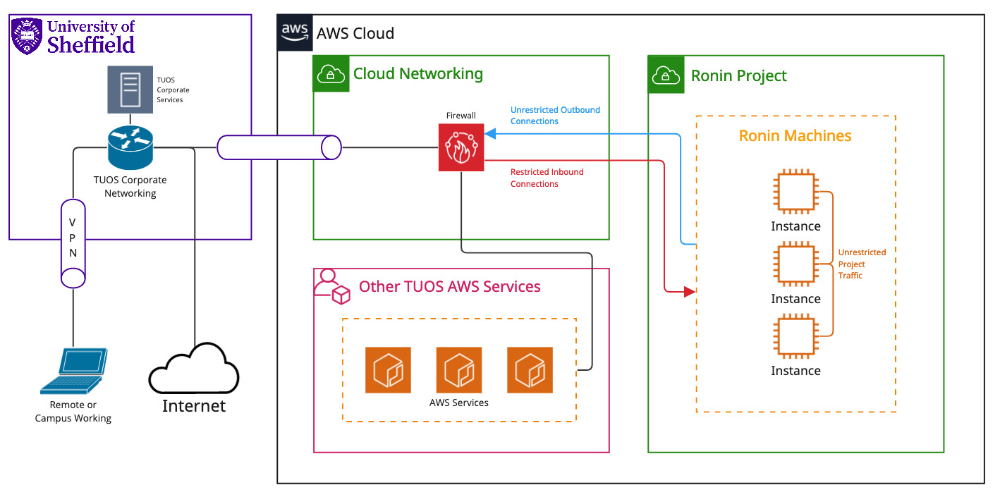

.. _projects:

Ronin Projects
=======================================

When you are given access to :term:`RCC` it will come in the form of one or more Projects presented inside of Ronin.
Resources you create inside of these projects have differing levels of network access and accessability.

Networking
---------------------------------------

For the most part you will be working with what Ronin calls Machines and what we call :term:`Instances<Instance>`, these resources are placed into their own project specific subnet.
This is a way for Ronin to allow instances in a project to communicate with one another in a isolated manner.

Instances in your project/s have unrestricted access other instances in the same project, have access to the campus network and from there outbound to the web.
The graphic below goes into more detail:

.. note:: 

    Only outbound networking from the subnet is unrestricted. Inbound access to the Ronin Instances is limited to SSH over port 22 TCP

We encourage you to make use of `Ronin Link's <https://blog.ronin.cloud/ronin-link/>`_ "Connect to an Application" feature to proxy applications directly to your machine,
this makes it as if the service were running locally.

S3 / Object Storage
---------------------------------------

Object Storage created in the RCC platform has restrictions on its access.
The key restriction is that you will be required to log into the university VPN to access this storage regardless of if you are at or away from the campus network.

.. note::
    More details on how to access storage to come